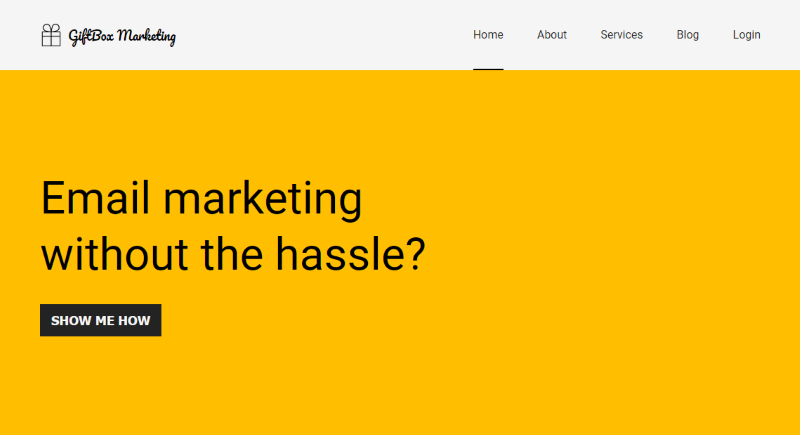

# Using ConfigCat's feature flags with Elmah

Read the blog post [here](https://configcat.com/blog/)

This is a fictional website for a marketing company made with Vue.js. It was used in the accompanying article to demonstrate how to use feature flags alongside an application monitoring platform called [Elmah](https://elmah.io/).

## Build & Run

### Prerequisites
- [NodeJS](https://nodejs.org/en/) (version 16 or higher)

### Running the app

**1.** Clone the [this repository](https://github.com/configcat-labs/feature-flags-with-elmah-sample).

**2.** Run the following commands to install the required NPM packages and run the app:

```sh
yarn add package.json
```

```sh
yarn dev
```

**3.** You should be able to view the app in your browser by visiting [http://localhost:5173/](http://localhost:5173/).

**4.** Here's what it should look like:



## Learn more

[Elmah Documentation](https://docs.elmah.io/) - learn about Elmah features and its API.

[**ConfigCat**](https://configcat.com) also supports many other frameworks and languages. Check out the full list of supported SDKs [here](https://configcat.com/docs/sdk-reference/overview/).

You can also explore other code samples for various languages, frameworks, and topics here in the [ConfigCat labs](https://github.com/configcat-labs) on GitHub.

Keep up with ConfigCat on [Twitter](https://twitter.com/configcat), [Facebook](https://www.facebook.com/configcat), [LinkedIn](https://www.linkedin.com/company/configcat/), and [GitHub](https://github.com/configcat).

## Author
[Chavez Harris](https://github.com/codedbychavez)

## Contributions
Contributions are welcome!
